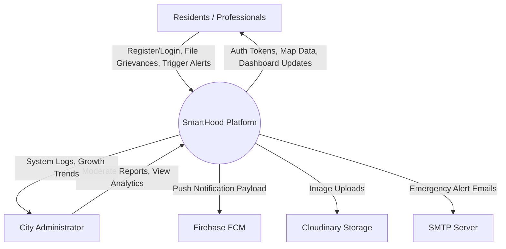
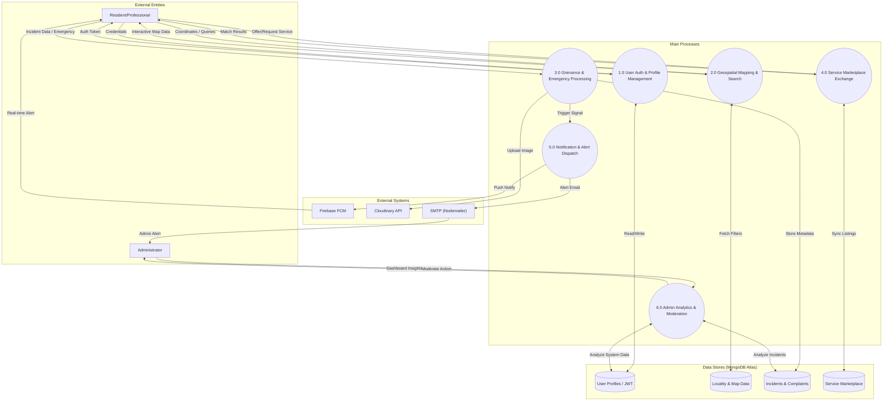

# SmartHood Data Flow Diagram (DFD) Documentation

This document provides a detailed breakdown of the Data Flow Diagram for the **SmartHood Hyper-local Community Platform**, adapted to the specific visual logic of automated incident processing.

## 1. Visual Workflow Diagram (Detailed DFD)

Following the structure of automated monitoring systems, this diagram represents the flow of a community report or emergency alert through the SmartHood ecosystem.

```mermaid
graph TD
    Input[Resident / Professional Input] --> Preprocess[Geospatial Preprocessing <br/> (Coordinate Capture & Media Normalization)]
    Preprocess --> Auth[Identity & Data Validation <br/> (JWT / Mongoose Schema Validation)]
    Auth --> Match[Service Matching & Incident Filter <br/> (MongoDB Geospatial Indexing)]
    
    Match --> Decision{Process Type}

    Decision -- "Verified Service" --> Known[Verified Service Listing]
    Decision -- "Emergency Incident" --> Unknown[Emergency / Unknown Incident]

    Known --> Alert1[Update Marketplace <br/> & Sync Dashboard]
    
    Unknown --> Alert2["[Send Multi-Channel Alert <br/> (FCM / SMTP Email)]"]
    Alert2 --> Wait["Wait for Admin / Neighbor <br/> Response & Oversight"]
    Wait --> Resolve[Resolve Incident if <br/> Approved / Actioned]

    style Alert2 fill:#f9f,stroke:#333,stroke-width:2px
    style Alert1 fill:#ccf,stroke:#333,stroke-width:2px
```

---

## 2. DFD Level 0: Context Diagram

The Context Diagram provides a high-level view of the entire SmartHood system and its interaction with external entities.



---

## 3. DFD Level 1: Functional Overview

The Level 1 DFD breaks down the system into its primary functional processes.


